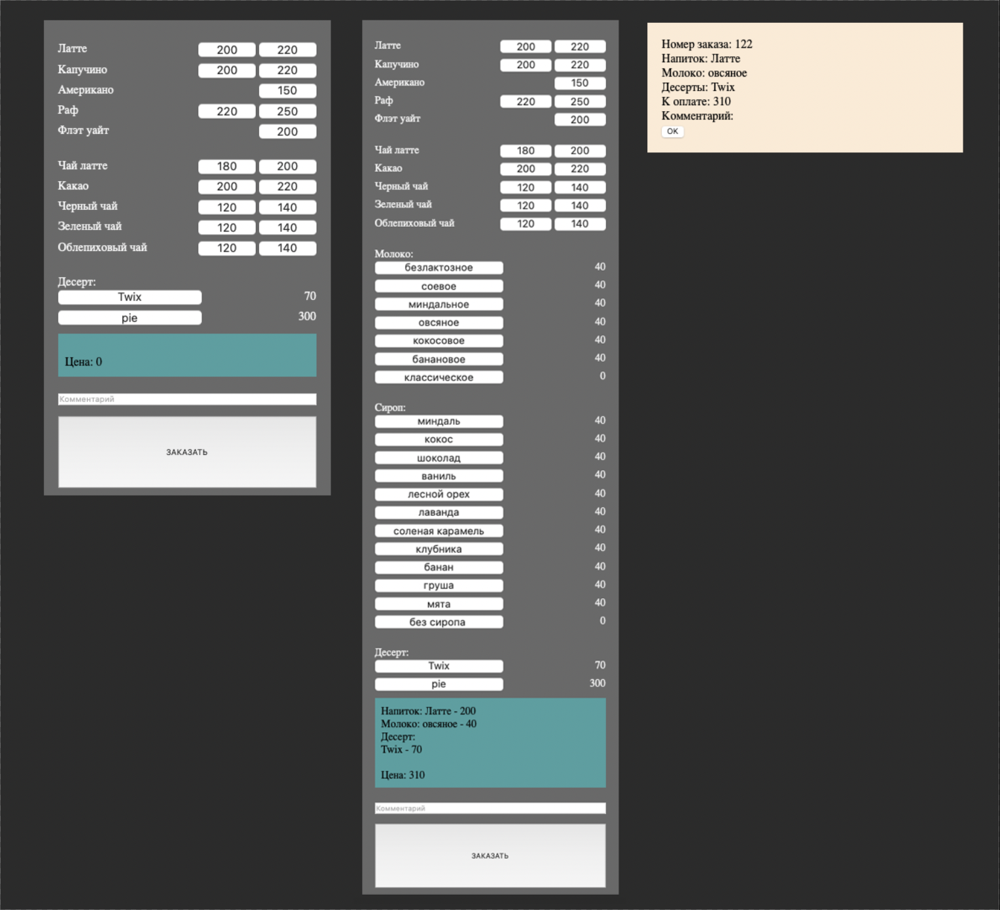
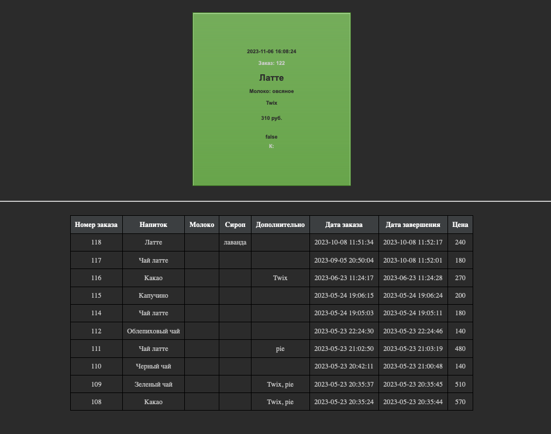
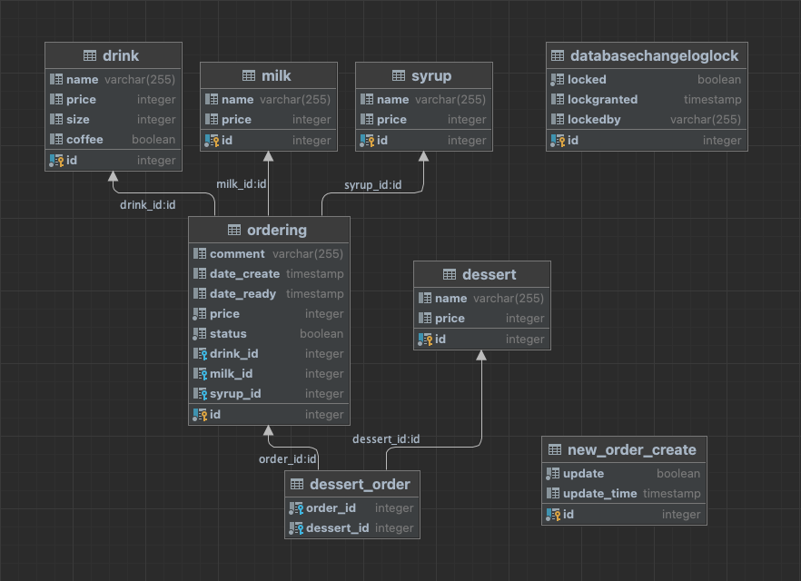

# coffee-rest

Идея проекта - избавиться от очередей за кофе. Сделать заказ через rest client, подойти за готовой чашкой кофе спустя 5 минут. Проект состоит из клиентской и серверной части.
<br><br> Клиентская часть позволяет оставить заказ, а также включает в себя часть администратора (бариста), в которой видно поступившие заказы.<br>Серверная часть обрабатывает поступающие запросы, от клиенсткой части, взаимодействуя с базой данных.

### Запуск

Для быстрого запуска добавлен файл docker-compose, который включает в себя сборку и запуск серверной и клиентской частей, а также разворачивает postgres базу данных с заготовленным dump примером.
1. Соберите проект, для этого из корня проекта введите в терминале команду:
```
gradle build 
```
2. Поднимите контейнеры с базой данных, сервером и клиентом. Для этого можно воспользоваться docker compose:
```
docker compose up -d
```

Клиентская часть с меню доступна по адресу: http://localhost:8080/



Клиентская часть с окном для бариста доступна по адресу: http://localhost:8080/barista



Схема базы данных:

